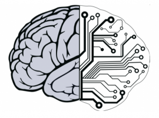

<a name="readme-top"></a>

[![Contributors][contributors-shield]][contributors-url]

[![Forks][forks-shield]][forks-url]
[![Stargazers][stars-shield]][stars-url]
[![Issues][issues-shield]][issues-url]
[![MIT License][license-shield]][license-url]
[![LinkedIn][linkedin-shield]][linkedin-url]

<br />
<div align="center">
    <a href="https://github.com/Study-Stuffs/Research-works.git">
    
    </a>

<h3 align="center">Research-works</h3>
<p align="center">
    A repository for all of my research works and studies.
    <br />
    <a href = " https://github.com/Study-Stuffs/Research-works/wiki"><strong>Explore the wiki »</strong></a>
    <br />
    <br />
    <a href="https://github.com/Study-Stuffs/Research-works/issues">Report Bug/Request Feature/Present Ideas</a>
    .
    <a href="https://github.com/The-DarK-os">Explore my other works</a>
    .
</p>
</div>

<!-- TABLE OF CONTENTS -->
<details>
  <summary>Table of Contents</summary>
  <ol>
    <li>
      <a href="#ideas-and-proposals">Ideas and proposals</a>
      <ul>
        <li><a href="#languages will be used">Languages used</a></li>
      </ul>
    </li>
    <li>
      <a href="#getting-started">Getting Started</a>
      <ul>
        <li><a href="#prerequisites">Prerequisites</a></li>
        <li><a href="#installation">Installation</a></li>
      </ul>
    </li>
    <li><a href="#References">References/roadmap</a></li>
    <li><a href="#Contributing">Contributing</a></li>
    <li><a href="#contact">Contact</a></li>
    <li><a href="#acknowledgments">Acknowledgments</a></li>
  </ol>
</details>


## Ideas and proposals

There are many ideas and proposals that I have in my mind. I will be adding them here as I get time to work on them. If you want to contribute to any of them, feel free to contact me.

You can check out my unfinished/underdeveloped works under the [Proposals](Proposals/) folder.

For now I'm working on three different research fields:
* Neuromorphic computing
* Social-Networking and Game theory
* Climate models

Ideas that I may work on in the future:
* A Neural network based on somatosensory cortex.
* Optimization of Spiking neural network models.
* A new algorithm on Evolutionary/Heuristic algorithms.
* A new algorithm for MDR,EDR and XDR malware detection.

### Languages used

Most of the algorithms and implementations will be written in python in form of jupyter notebooks. I'm learning new languages and will be using them in future.

Languages I have in mind for implementation:
* Python (Primary)
* Julia (Primary)
* C/C++ (Secondary)
* Mojo (Future)
* R (Future)
* Matlab (future)


## Getting Started

To contribute, you can just clone the repository and start working on the ideas. If you want to contribute to any of the ideas, you can contact me and I will add you as a collaborator.

You can just clone the repository by using the following command:

```sh
git clone https://github.com/Study-Stuffs/Research-works.git
```

### Prerequisites
Learning the basics of what I'm doing is a must, I have added some references in the [References](References/) folder. You can also check out the [wiki](https://github.com/Study-Stuffs/Research-works/wiki) where I document some of the basics of the fields I'm working on.  
Topics I'll be covering:
* Neuroscience/Computational Neuroscience
* Machine learning/deep learning/reinforcement learning
* Game theory
* Evolutionary algorithms/Heuristic algorithms
* Complex mathematical models and their implementations
* Endpoint detective responses/Malware detection
* Graph science 

It can be a lot and overwhelming, but I really enjoy studying these. I will be adding more topics as I get time to study them.
If you're interested and wanted to work on something, let me know. I will be happy to contribute.

### Installation

As mentioned above, I will be using python for most of the implementations. You can install python from [here](https://www.python.org/downloads/). I will be using python 3.8.5 for most of the implementations. You can install the required packages by using the following command:

```sh
pip install -r requirements.txt
```

## References

I will be adding research paper links in the [References](References/) folder. I will be making a roadmap for each topics I've mentioned.

## Contributing

I'm looking for mentors and collaborators who are skilled in the following subjects/fields:
* Neuroscience 
* Biology in general (mostly on anatomy of brain)
* Programmer (python or any other language)
* Mathematics (who can modify the equations and models)
* Game theory
* Machine learning

I'm happy to look new ideas and proposals. If you have any, feel free to contact me.

## Contact

You can contact me through my email: da4kek@gmail.com.  


[contributors-shield]: https://img.shields.io/github/contributors/Study-Stuffs/Research-works.svg?style=for-the-badge
[contributors-url]: https://github.com/Study-Stuffs/Research-works/graphs/contributors
[forks-shield]: https://img.shields.io/github/forks/Study-Stuffs/Research-works.svg?style=for-the-badge
[forks-url]: https://github.com/Study-Stuffs/Research-works/network/members
[stars-shield]: https://img.shields.io/github/stars/Study-Stuffs/Research-works.svg?style=for-the-badge
[stars-url]: https://github.com/Study-Stuffs/Research-works/stargazers
[issues-shield]: https://img.shields.io/github/issues/Study-Stuffs/Research-works.svg?style=for-the-badge
[issues-url]: https://github.com/Study-Stuffs/Research-works/issues
[license-shield]: https://img.shields.io/github/license/Study-Stuffs/Research-works.svg?style=for-the-badge
[license-url]: https://github.com/othneildrew/Best-README-Template/blob/master/LICENSE.txt
[linkedin-shield]: https://img.shields.io/badge/-LinkedIn-black.svg?style=for-the-badge&logo=linkedin&colorB=555
[linkedin-url]: https://www.linkedin.com/in/anirudhakadark/