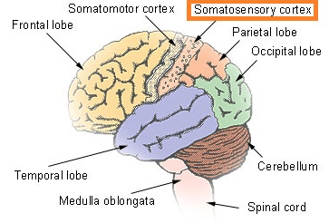

# Somatosensory Cortex Function and location:

> The somatosensory cortex is a region of the brain that is responsible for receiving and processing sensory information across the body. Information such as touch,pressure and pain are being processed.

The cortex is located within the postcentral gyrus of the parietal lobe and lies behind the primary motor cortex of the frontal lobe.

    

## Somatosensory Pathway:

The primary neurons are the sensory receptors within the periphery of the somatosensory cortex, which can detect various stimuli such as touch or temperature. The secondary neurons are located within the spinal cord and brainstem and act as a relay station. 

Afferent pathways which carry signals to the central nervous system in the spinal cord and brainstem work by passing information from the periphery and the rest of the body to the brain. These will then terminate in either the thalamus or the cerebellum.

The tertiary neurons, located within the thalamus and cerebellum, will then project to the somatosensory cortex. 

### Cortex Area function:

> It Comprises the primary and secondary somatosensory cortex.

    

#### Primary Somatosensory Cortex:

The primary somatosensory cortex, also referred to as S1, is found in a ridge of the cerebral cortex known as the postcentral gyrus.

Located just posterior of the central sulcus, a fissure that runs down the side of the cerebral cortex, the S1 cortex comprises of Broadmann's areas 3a, 3b, 1 and 2. 

The S1 somatosensory cortex is responsible for the processing of sensations from the body. These sensations are received through receptors located throughout the body that are responsible for detecting sensations such as touch, pain, temperature and proprioception.

**Broadmann area:**