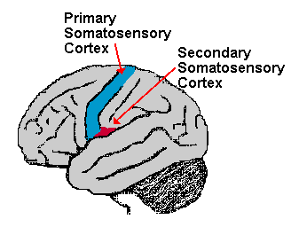

# Somatosensory Cortex Function and location:

> The somatosensory cortex is a region of the brain that is responsible for receiving and processing sensory information across the body. Information such as touch,pressure and pain are being processed.

The cortex is located within the postcentral gyrus of the parietal lobe and lies behind the primary motor cortex of the frontal lobe.

    

## Somatosensory Pathway:

The primary neurons are the sensory receptors within the periphery of the somatosensory cortex, which can detect various stimuli such as touch or temperature. The secondary neurons are located within the spinal cord and brainstem and act as a relay station. 

Afferent pathways which carry signals to the central nervous system in the spinal cord and brainstem work by passing information from the periphery and the rest of the body to the brain. These will then terminate in either the thalamus or the cerebellum.

The tertiary neurons, located within the thalamus and cerebellum, will then project to the somatosensory cortex. 

### Cortex Area function:

> It Comprises the primary and secondary somatosensory cortex.

    

#### Primary Somatosensory Cortex:

The primary somatosensory cortex, also referred to as S1, is found in a ridge of the cerebral cortex known as the postcentral gyrus.

Located just posterior of the central sulcus, a fissure that runs down the side of the cerebral cortex, the S1 cortex comprises of Broadmann's areas 3a, 3b, 1 and 2. 

The S1 somatosensory cortex is responsible for the processing of sensations from the body. These sensations are received through receptors located throughout the body that are responsible for detecting sensations such as touch, pain, temperature and proprioception.

**Broadmann area:**
The broadmann areas of cerebral cortex are defined by its cytoarchitecture.  
Area 1, 2, 3 are the primary somatosensory cortex (postcentral gyrus).
*Areas 1,2,3* is the region which is associated with several senses such as the ones for:    
* Localization of touch, temperature, vibration and pain.
* sensory perception and proprioception especially the legs, trunk, arms, hands, face and lips.
* skilled and coordinated orofacial movement. 
* motor learning

#### Secondary Somatosensory Cortex:

The secondary somatosensory cortex, also referred to as S2 is not as well understood as the primary somatosensory cortex, and it is believed that a lot of fibres in this area come from the primary somatosensory cortex.

The S2 cortex is located adjacent to the primary S1 in the upper part of the lateral sulcus, a fissure that separates the frontal and parietal lobes from the temporal lobe.

The cortex is belived to be involved in tactile object recognition and memory. It is suggested that whilst the S1 area receives sensory information, it requires the secondary area to store, process and retain this information.

